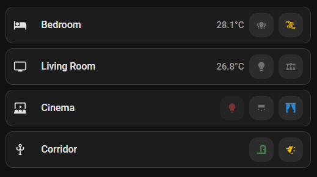

# Room Card

A compact Home Assistant Lovelace card for room overviews — icon, name, optional temperature, and quick-access buttons for lights and covers — with a visual editor.

## Screenshots

### Rooms with light, curtain, door and temperature


## Features

- 🏠 Icon + name, tap to navigate to the room's dashboard view
- 🌡️ Optional temperature display next to the name
- 💡 Quick-access buttons for lights/switches — tap to toggle, color-coded by state (on/off/unavailable)
- 🪟 Quick-access buttons for covers — tap opens the standard HA more-info dialog, icon switches between an "open" and "closed" state automatically
- ↕️ Drag to reorder quick-access buttons
- 🎨 Fully adapts to your Home Assistant theme (light & dark)
- ⚙️ Built-in visual editor — no YAML required

## Installation

### HACS (recommended)

1. Open HACS → Frontend
2. Click the three-dot menu → **Custom repositories**
3. Add `https://github.com/Nellyskills/room-card` → Category: **Dashboard**
4. Search for **Room Card** and install
5. Reload your browser

### Manual

1. Download `room-card.js` from the [latest release](https://github.com/Nellyskills/room-card/releases/latest)
2. Copy it to `config/www/room-card.js`
3. Go to **Settings → Dashboards → Resources** and add:
   ```
   URL: /local/room-card.js
   Type: JavaScript Module
   ```
4. Hard reload your browser (Ctrl+Shift+R)

## Usage

Add the card via the visual editor or paste YAML manually.

### Minimal config

```yaml
type: custom:room-card
icon: mdi:sofa
name: Wohnzimmer
```

### Full example

```yaml
type: custom:room-card
icon: mdi:television
name: Wohnzimmer
navigation_path: /lovelace/wohnzimmer
temperature_entity: sensor.wohnzimmer_temperatur
entities:
  - type: light
    icon: mdi:lightbulb
    entity: light.wohnzimmer
  - type: light
    icon: mdi:vanity-light
    entity: switch.wohnzimmer_esstisch_l1
  - type: cover
    icon_open: mdi:curtains
    icon_closed: mdi:curtains-closed
    entity: cover.wohnzimmer_vorhang
```

## Configuration

| Option | Required | Default | Description |
|--------|----------|---------|-------------|
| `icon` | ❌ | `mdi:sofa` | Room icon |
| `name` | ❌ | — | Room name |
| `navigation_path` | ❌ | — | Lovelace path to open when tapping the icon/name |
| `temperature_entity` | ❌ | — | Sensor entity shown next to the name |
| `entities` | ❌ | `[]` | List of quick-access buttons (see below) |

### Entity item

| Option | Required | Description |
|--------|----------|-------------|
| `type` | ✅ | `light` or `cover` |
| `entity` | ✅ | The `light.*`/`switch.*` or `cover.*` entity to control |
| `icon` | ❌ | Icon shown (type `light` only) |
| `icon_open` | ❌ | Icon shown when open (type `cover` only) |
| `icon_closed` | ❌ | Icon shown when closed (type `cover` only) |

## License

MIT © [Nellyskills](https://github.com/Nellyskills)
